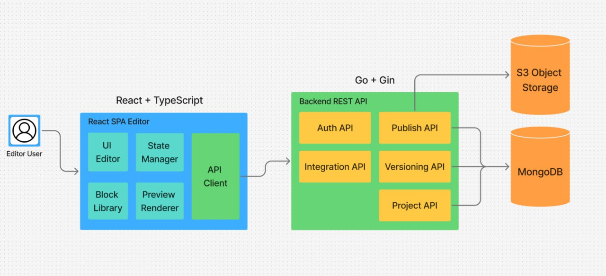
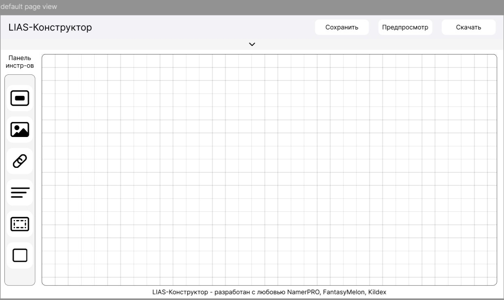
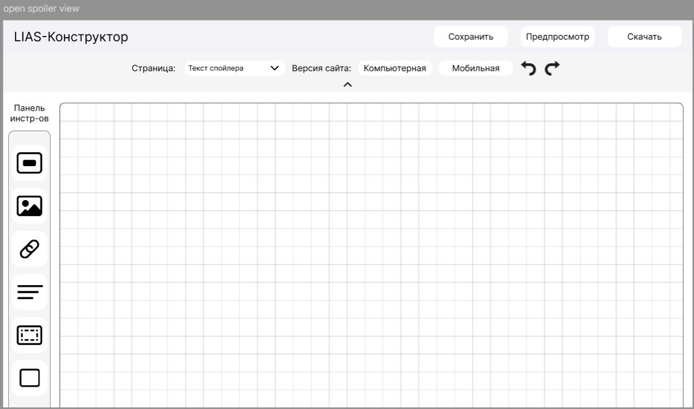

# Landing Builder Platform

Платформа для создания и управления лендинг-страницами, позволяющая сотрудникам компании создавать, редактировать и публиковать промо-страницы без участия разработчиков.

Система предоставляет backend-API для хранения и управления структурами лендингов, которые описываются в виде JSON-моделей.

В дальнейшем платформа будет включать визуальный drag-and-drop редактор, систему шаблонов и механизм публикации статических страниц.

## Введение, описание проблемы

Внутри компании регулярно возникает необходимость быстро создавать промо-страницы, лендинги и маркетинговые страницы для различных кампаний.

Основные сложности существующего процесса:

- **Зависимость от разработчиков**: для создания каждой новой страницы требуется участие frontend-разработчиков.
- **Длительное время запуска**: даже простые лендинги требуют разработки, тестирования и деплоя.
- **Отсутствие централизованного управления**: страницы создаются в разных проектах и не имеют единой структуры хранения.
- **Отсутствие версионирования контента**: история изменений страниц и возможность отката обычно отсутствует.

### Предлагаемое решение

Разрабатывается backend-сервис для управления лендингами, который хранит структуры страниц в базе данных и предоставляет API для их создания, редактирования и получения.

Структура лендинга описывается в виде JSON-модели, что позволяет гибко хранить контент страницы и впоследствии использовать его для генерации статических HTML-страниц.

В перспективе система будет дополнена:

- визуальным редактором страниц (drag-and-drop),
- библиотекой шаблонов,
- системой публикации лендингов через CDN.

### Ключевые компоненты

- **Backend API** — сервис на Go, предоставляющий REST API для управления лендингами.
- **MongoDB** — база данных для хранения структур страниц и их метаданных.
- **Repository Layer** — слой доступа к данным, инкапсулирующий работу с базой.
- **Domain Models** — модели данных, описывающие структуру лендинга.

### Ожидаемый эффект

Разработка платформы позволит:

- сократить время создания лендингов,
- централизовать хранение страниц,
- обеспечить расширяемую архитектуру для будущего конструктора страниц,
- упростить интеграцию с другими сервисами компании.

## Use Cases

### Сценарий "Применение готового шаблона"

#### Участники: 
- Пользователь
- Система
#### Предусловие:
- Пользователь авторизовался в системе.
- Пользователь создал новый лендинг.
- Пользователь открыл редактор лендинга.
#### Основной сценарий:
- Пользователь нажимает на "Использовать шаблон".
- Пользователь выбирает нужный шаблон из перечисленных в конструкторе.
- Система применяет шаблон, заменяя текущий дизайн.
#### Альтернативный сценарий:
1. Шаблон содержит неподдерживаемые элементы.
- Система уведомляет о невозможности применить данный шаблон с текущим контентом.
#### Постусловия:
- Шаблон применен и пользователь может продолжить наполнение лендинга.

 ---

### Сценарий "Публикация лендинга"

#### Участники:
- Контент-менеджер 
- Система
#### Предусловие:
- Пользователь авторизовался в системе.
- Пользователь открыл раздел управления лендингами.
- Существует как минимум один созданный лендинг.
#### Основной сценарий:
- Пользователь выбирает нужный лендинг из списка.
- Пользователь нажимает кнопку "Опубликовать" для выбранного лендинга.
- Система предлагает выбрать домен для публикации.
- Пользователь выбирает или настраивает домен.
- Система генерирует финальную версию лендинга.
- Система загружает лендинг на сервер.
#### Альтернативный сценарий:
1. Нет ни одного лендинга.
- Система выдает сообщение об отсутствии лендингов.
- Система предлагает создать новый лендинг.
#### Постусловия:
- Лендинг опубликован и доступен по указанной ссылке.
- Статус лендинга в системе изменен на "Опубликован".
- Система предоставляет пользователю ссылку на опубликованный лендинг.

 ---

### Сценарий "Просмотр публичной страницы"

#### Участники:
- Посетитель сайта
- Система
#### Предусловие:
- Лендинг опубликован в сети и доступен по ссылке.
#### Основной сценарий:
- Посетитель переходит по ссылке на лендинг.
- Система загружает и отображает страницу лендинга.
#### Альтернативный сценарий:
1. Страница недоступна:
- Система отображает страницу с сообщением об ошибке.
2. Устаревшая версия браузера.
- Система показывает предупреждение и рекомендует обновить браузер или использовать другой.
#### Постусловия:
- Посетитель успешно ознакомился с информацией на лендинге.

 ---

### Сценарий "Аутентификация"

#### Участники:
- Пользователь
- Система
#### Предусловие:
- Система доступна для взаимодействия.
#### Основной сценарий:
- Пользователь переходит на главную страницу конструктора.
- Пользователь нажимает кнопку "Войти".
- Пользователь вводит логин и пароль.
- Система проверяет введенные данные.
- Система перенаправляет пользователя в личный кабинет.
#### Альтернативный сценарий:
1. Неверные данные от учетной записи:
- Система отображает сообщение об ошибке.
- Система предлагает повторить ввод или восстановить пароль.
#### Постусловия:
- Пользователь успешно авторизован.

---

### Сценарий "Управление списком лендингов"

#### Участники:
- Контент-менеджер
- Система
#### Предусловие:
- Пользователь авторизовался в системе.
- Пользователь находится в разделе управления лендингами.
#### Основной сценарий:
- Система отображает список всех лендингов пользователя.
- Пользователь выбирает необходимое действие(создать новый лендинг, удалить выбранные лендинги, редактировать).
- Система выполняет запрос пользователя.
#### Альтернативный сценарий:
1. Лендинги отсутствуют: 
- Система выводить сообщение и предлагает создать новый лендинг.
#### Постусловия:
- Изменения применены.

---

### Сценарий "Редактирование лендинга"

#### Участники:
- Контент-менеджер
- Система
#### Предусловие:
- Пользователь авторизовался в системе.
- Пользователь открыл раздел управления лендингами.
- Пользователь выбрал нужный ему лендинг.
- Пользователь открыл редактор лендинга.
#### Основной сценарий:
- Пользователь выбирает нужное ему действие(Загрузка собственного изображения, Добавление текстового блока, Добавление формы).
- Пользователь вносит необходимые изменения.
- Пользователь нажимает кнопку "Сохранить".
- Система сохраняет все изменения и отображает уведомление об успешном сохранении.
#### Альтернативный сценарий:
1. Текст слишком длинный для блока.
- Система автоматически уменьшает размер шрифта или предлагает увеличить блок.
2. Неподдерживаемый формат файла.
- Система отображает окно с ошибкой о неверном формате изображения.
3. Слишком большой объем файла.
- Система отображает окно с предупреждением о большом занимаемом объеме файла.
4. Обязательные поля не заполнены.
- Система подсвечивает незаполненные обязательные поля.
#### Постусловия:
- Изменения сохранены и отображены на сайте.

---

## Архитектура

### Описание архитектуры

Система представляет собой backend-сервис для управления лендинг-страницами.

Сервис предоставляет REST API для выполнения основных операций:

- создание лендинга,

- получение информации о лендинге,

- обновление структуры страницы,

- удаление лендинга.

Структура страницы хранится в базе данных в формате JSON, что позволяет гибко описывать различные блоки страницы.

### Архитектурные слои

Проект реализован по принципу разделения ответственности между слоями:

API Layer -> Repository Layer -> Database

### Основные компоненты

#### main.go

Точка входа приложения.

Основные задачи:

- запуск HTTP-сервера,

- инициализация подключения к базе данных,
- регистрация маршрутов API.

#### db

Пакет отвечает за инициализацию подключения к базе данных.

Основные функции:

- создание клиента MongoDB,
- управление подключением к базе,
- предоставление экземпляра базы для других компонентов приложения.

#### models

Пакет содержит доменные модели приложения.

Основная модель:

##### Landing

Модель описывает структуру лендинга и его основные поля, например:

- идентификатор страницы,
- название,
- структура блоков страницы,
- дата создания,
- дата обновления.

Модель используется как для хранения данных в базе, так и для передачи данных через API.

#### repository

Слой доступа к данным.

Repository инкапсулирует работу с базой данных и предоставляет методы для работы с лендингами.

Примеры операций:

- создание лендинга,
- получение лендинга по ID,
- обновление лендинга,
- удаление лендинга.

Такой подход позволяет отделить бизнес-логику приложения от конкретной реализации базы данных.

### Взаимодействие компонентов

Основной поток выполнения запроса выглядит следующим образом:

1. Клиент отправляет HTTP-запрос к API сервера.
2. Сервер обрабатывает запрос и вызывает соответствующий метод репозитория.
3. Репозиторий выполняет операции с базой данных MongoDB.
4. Результат возвращается обратно клиенту в формате JSON.

### Функциональные требования

FR-1. Система должна предоставлять REST API для управления лендингами.
FR-2. Система должна поддерживать создание нового лендинга.
FR-3. Система должна поддерживать получение информации о лендинге по идентификатору.
FR-4. Система должна поддерживать обновление данных лендинга.
FR-5. Система должна поддерживать удаление лендинга.
FR-6. Данные лендингов должны храниться в базе данных MongoDB.

### Нефункциональные требования

NFR-1. API должен возвращать ответы в формате JSON.
NFR-2. Архитектура приложения должна поддерживать расширение функциональности (например добавление редактора страниц).
NFR-3. Кодовая база должна быть разделена на логические модули (models, repository, db).

## Наброски фронтенда

## Тех. стек

### Backend

#### Go

Основной язык разработки backend-сервиса.

Go выбран благодаря:

- высокой производительности,
- простоте разработки сетевых сервисов,
- развитой стандартной библиотеке.

#### MongoDB

MongoDB используется как основная база данных для хранения лендингов.

Причины выбора:

- нативная работа с JSON-подобными структурами,
- гибкая схема данных,
- удобство хранения структур страниц.

### Архитектурные компоненты

#### Repository Pattern

В проекте используется паттерн Repository.

Этот подход позволяет:

- изолировать логику работы с базой данных,
- упростить тестирование,
- при необходимости заменить базу данных без изменений в бизнес-логике.

### Управление зависимостями

#### Go Modules

Go Modules используются для управления зависимостями проекта.

Файлы:

- go.mod
- go.sum